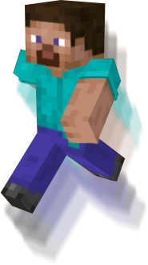

# Drav Parkour

A Spigot plugin that adds a never ending parkour to Minecraft. The blocks autogenerate as the player jumps, and highscores are kept and displayed on a leaderboard.

NOTE: This is one of my first real dives into Java coding, so the code is a bit all over the place, this is actively being fixed.

## Features

### Infinite Parkour

The plugin generates parkour blocks endlessly in front of the user, allowing for a never ending competition among players.

### Scoreboard

A customizable scoreboard is avalible to use to show who is on top and how many jumps they have completed.

### Customizable

Customizablity is avalible to the user, from the blocks they jump on, to the sound that is generated everytime they complete a successful jump.

### Put it Anywhere

With the ease of the commands, the parkour can be put and generate almost anywhere, as long as there is 4 blocks below the lowest point to allow for the auto detection of a player falling to work.
